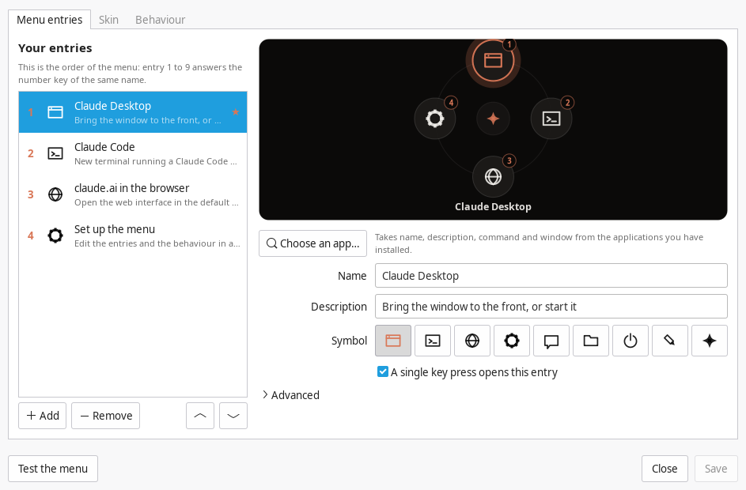
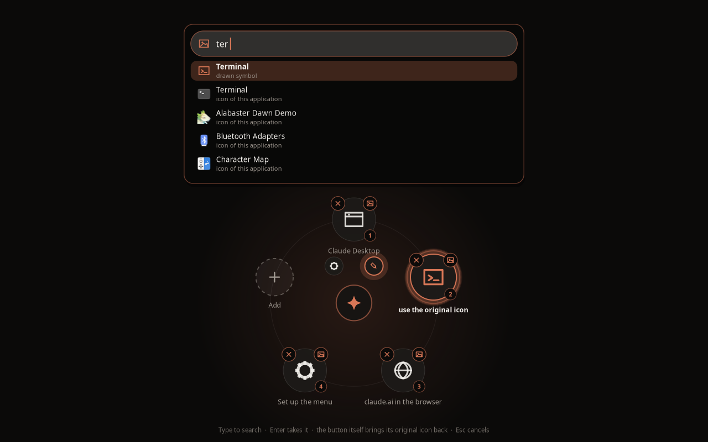

# copilot-key

[English](README.md) · **Deutsch**

Die Copilot-Taste des **Minisforum AI X1 Pro** sinnvoll belegen – unter Linux,
mit Auswahlmenü, Fenster-Toggle und eigenem Sound-Set.

* **Kurz drücken** → Fenster der primären Aktion nach vorne holen bzw.
  minimieren. Läuft nichts, öffnet sich das Auswahlmenü.
* **Doppelt drücken** → Auswahlmenü erzwingen.
* **Nochmal drücken, während das Menü offen ist** → Menü schließen.
* Jeder Zustandswechsel hat seinen eigenen Klang.
* Eingerichtet wird das Menü ohne Konfigurationsdatei: die Apps kommen aus
  einer Liste – wahlweise in einem eigenen Fenster oder direkt im Rad.
* Skins bestimmen das Aussehen des Rads – drei sind dabei, weitere sind eine
  kleine Textdatei entfernt.

Das Menü legt sich als Vollbild-Overlay über den abgedunkelten Bildschirm und
rollt kreisförmig aus der Mitte auf. Bedienen lässt es sich mit `1`–`9`, den
Pfeiltasten, dem Mausrad oder per Klick; `Esc` oder ein Klick ins Leere
schließt es wieder. Die Symbole sind reine Cairo-Vektorzeichnungen – kein
Icon-Theme, keine fremden Grafiken.


Alles, was das Programm ausgibt, richtet sich nach deiner Locale: Deutsch auf
einem deutschen System, sonst Englisch (siehe [Sprache](#sprache)).

Entwickelt für Linux Mint 22.3 (Cinnamon, X11, Ubuntu-24.04-Basis); das Menü
ist unter GTK 3 gegengeprüft, die Tastenkette muss auf der Zielmaschine einmal
mit `detect-key.sh` bestätigt werden.

---

## Installation

```bash
git clone https://github.com/SoulInfernoDE/copilot-key-linux
cd copilot-key-linux
./install.sh
```

Das Skript wird als normaler Benutzer gestartet und fragt selbst nach `sudo`.
Es erledigt:

1. Abhängigkeiten prüfen (`wmctrl`, `xdotool`, `python3-gi`, `python3-gi-cairo`,
   `pulseaudio-utils`)
2. `keyd` installieren – aus den Paketquellen, sonst aus dem Quellcode nach
   `~/Downloads/keyd` mit Prefix `/usr/local`
3. Programme nach `/usr/local/bin`, Sounds und Skins nach
   `/usr/local/share/copilot-key`
4. `config/keyd-copilot.conf` nach `/etc/keyd/copilot.conf` und `keyd` neu starten
5. Cinnamon-Tastenkürzel `Ctrl+Alt+Shift+F12` → `copilot-key` eintragen

### Ein Rechner, mehrere Menschen

Die Installation ist gemeinsam, das Menü nicht. Jeder Nutzer bekommt seine
eigene `~/.config/copilot-key/config.toml` – beim ersten Tastendruck aus den
Vorgaben angelegt – und sein eigenes Tastenkürzel, eingetragen von einem
Login-Hook in `/etc/xdg/autostart`. Niemand muss den Installer zweimal
ausführen, und niemand bearbeitet das Menü eines anderen.

Lieber alles im eigenen Zuhause? `./install.sh --user` legt es wie bisher
unter `~/.local` ab.

Entfernen: `./uninstall.sh` (räumt beides ab und lässt die Konfigurationen
anderer Nutzer in Ruhe).

Nach einem Update des Projektordners genügt ein erneutes `./install.sh` – die
bestehende Konfiguration bleibt dabei unangetastet.

---

## Wie die Taste überhaupt ankommt

Die Copilot-Taste sendet keinen eigenen Tastencode, sondern den Akkord
**LeftMeta + LeftShift + F23**. Desktop-Umgebungen können diesen Akkord meist
nicht sauber als Kürzel aufnehmen – deshalb die zweistufige Kette:

```
Copilot-Taste  →  keyd (evdev, vor X11/Wayland)  →  Ctrl+Alt+Shift+F12  →  Cinnamon-Kürzel  →  copilot-key
```

`keyd` arbeitet unterhalb des Fenstersystems und funktioniert daher unter X11
und Wayland gleichermaßen.

Sendet die Taste bei dir etwas anderes, zeigt

```bash
./detect-key.sh
```

den tatsächlichen Code an (nutzt `keyd monitor`, sonst `evtest`, sonst `xev`).
In `config/keyd-copilot.conf` stehen die gängigen Alternativen bereits
auskommentiert bereit – Zeile tauschen, dann `sudo keyd reload`.

---

## Konfiguration

Das Menü bringt seinen eigenen Editor mit, es muss also nichts in eine Datei
getippt werden:



Zu öffnen über das Menü selbst (der Zahnrad-Eintrag), über das Startmenü
(„Copilot-Tasten-Menü") oder im Terminal:

```bash
copilot-key configure
```

Links werden Einträge angelegt, sortiert und entfernt. **App auswählen …**
listet jede installierte Anwendung auf und füllt Name, Beschreibung, Befehl
und Fenster in einem Rutsch – für die meisten Einträge ist das schon die ganze
Arbeit. Rechts zeigt das Rad, wie das Menü aussehen wird, und **Menü testen**
öffnet das echte Menü mit dem aktuellen Stand, gespeichert oder nicht. Alles
unter *Erweitert* ist optional.

Unter **Verhalten** liegen Sounds, Lautstärke, das Zeitfenster für den
Doppeldruck, die Überschrift, der Menü-Stil, ob die Buttons die Original-Icons
der Anwendungen statt der gezeichneten Symbole tragen, und ob das Editorfenster
dem hellen oder dunklen Design des Desktops folgt.

### Oder ohne das Rad zu verlassen



Der Funke in der Mitte des Menüs ist ein Knopf. Er klappt zwei kleine
Werkzeuge aus: das Zahnrad öffnet das Editorfenster, der Stift macht das Rad
selbst zum Editor.

* **Ziehen** sortiert einen Button um; die anderen weichen dabei live aus.
* **Klick** auf einen Button fährt oberhalb des Rads eine Suchleiste aus.
  Tippen, mit `↑`/`↓` und `Enter` eine Anwendung wählen – sie landet auf dem
  angeklickten Button, der so lange leuchtet, bis er belegt ist.
* **+** legt einen weiteren Button an, **✕** auf einem Button entfernt ihn.
* Das **Bild-Zeichen** auf einem Button ändert sein Symbol: dieselbe Suche,
  jetzt mit den gezeichneten Symbolen und dem Icon jeder installierten
  Anwendung. Ein Klick auf den pulsierenden Button selbst holt sein
  Original-Icon zurück.
* `Esc` verlässt den Editiermodus, `Esc` noch einmal schließt das Menü.

Einen Speichern-Knopf gibt es nicht: jede Änderung steht sofort in der Datei.

Der Editor schreibt genau die Datei, die sich auch von Hand bearbeiten lässt:
`~/.config/copilot-key/config.toml`. Änderungen greifen sofort beim nächsten
Tastendruck. Beim Speichern bleibt eine Sicherung als `config.toml.bak`.

```toml
[general]
sounds = true
volume = 0.7
double_press_ms = 450
single_press = "toggle_or_menu"   # oder "toggle" / "menu"
menu_title = "Was darf es sein?"
close_on_focus_loss = true
menu_style = "radial"             # oder "list" für eine schlichte Liste
dim_opacity = 0.62                # wie stark der Hintergrund abgedunkelt wird

[[actions]]
id = "claude-desktop"
label = "Claude Desktop"
subtitle = "Fenster in den Vordergrund holen oder starten"
command = "@claude-desktop"
icon = "window"
window_class = "claude"
primary = true
```

Die Reihenfolge der `[[actions]]` ist die Reihenfolge im Menü und entspricht
den Zifferntasten `1`–`9`. `close_on_focus_loss = false` hilft, falls das Menü
auf einem ungewöhnlichen Desktop zu früh verschwindet.

| Platzhalter in `command` | Wirkung |
|---|---|
| `@claude-desktop` | sucht eine installierte Claude-Desktop-App, sonst `claude.ai` im Browser |
| `@terminal <cmd>` | öffnet `<cmd>` in einem neuen Terminalfenster (Terminal bleibt offen) |
| `@browser <url>` | öffnet `<url>` in der Standardanwendung |
| `@configure` | öffnet den grafischen Menü-Editor |
| `@edit-config` | öffnet diese Datei im Standardeditor |

Alles andere wird als gewöhnliche Kommandozeile ausgeführt. `window_class` ist
ein Teilstring der `WM_CLASS`; die passende Klasse findest du mit `wmctrl -lx`.

Verfügbare Symbole für `icon`: `window`, `terminal`, `globe`, `gear`, `chat`,
`folder`, `power`, `sparkle`. Ohne Angabe wird anhand von `id` und `label`
geraten, im Zweifel erscheint `sparkle`.

**Hinweis zu „Claude Desktop“:** Eine offizielle Desktop-App für Linux gibt es
nicht. Erkannt werden die gängigen inoffiziellen Pakete (`claude-desktop`,
`claude-desktop-app`, `claude-desktop-bin`); ist keines installiert, öffnet die
Aktion `claude.ai` im Browser. Mit `claude` in der `@terminal`-Aktion startet
dagegen die offizielle **Claude Code CLI**.

---

## Fehlersuche

```bash
./doctor.sh
```

prüft Installation, Sound-Dateien, Audio-Server, verfügbare Player, die
Grafik-Bibliotheken, keyd und das Tastenkürzel – und spielt zum Schluss einen
Testton ab. Kein Ton? Die häufigsten Ursachen:

* `pulseaudio-utils` fehlt → `sudo apt install pulseaudio-utils`
* Sounds nicht installiert → `./install.sh` erneut ausführen
* Ein einzelner Player streikt (`pw-play` etwa lehnt Ogg in manchen Builds ab):
  `COPILOT_KEY_DEBUG=1 ~/.local/bin/copilot-sound menu-open 0.9` zeigt, welcher
  Player greift und welcher abgelehnt hat

Erscheint statt des runden Menüs eine schlichte Liste, fehlt
`python3-gi-cairo` (`sudo apt install python3-gi-cairo`).

---

## Sprache

Menütexte, Skriptausgaben und die installierte Konfigurationsvorlage folgen
`$LC_ALL`, `$LC_MESSAGES` bzw. `$LANG`. Übersetzt ist Deutsch; alles andere
fällt auf Englisch zurück. Erzwingen lässt sich eine Sprache so:

```bash
COPILOT_KEY_LANG=en ~/.local/bin/copilot-key menu
```

Eine weitere Sprache ist schnell ergänzt: in `bin/copilot-key` ein Dict mit
denselben Schlüsseln zu `STRINGS` hinzufügen, in `lib/i18n.sh` ein
`T_<CODE>`-Array samt Zweig in `copilot_lang`, optional eine
`config/config.<code>.toml` mit übersetzten Beschriftungen. Fehlende Schlüssel
fallen einzeln auf Englisch zurück, eine Teilübersetzung genügt also.

Die Menübeschriftungen selbst stammen aus deiner eigenen Konfigurationsdatei –
die kannst du unabhängig von der Locale frei benennen.

---

## Skins

`menu_skin` in `[general]` bestimmt das Aussehen des Rads. Drei liegen bei:

| Skin | Aussehen |
|---|---|
| `terracotta` | der eingebaute: flache Scheiben, warmer Akzent |
| `aurora` | moderne mehrfarbige 3D-Kugeln mit Glanzlicht |
| `mint` | abgerundete Quadrate, sanfter Verlauf, Linux-Mint-Grün |

Ein Skin ist eine kleine TOML-Datei – Farben, Button-Form, Schattierung. Der
Reiter **Skin** im Editor listet alles Gefundene auf, zeigt es live und öffnet
den eigenen Skin-Ordner (`~/.config/copilot-key/skins/`); eine Kopie dort
überdeckt den mitgelieferten Skin gleichen Namens.

Einen eigenen zu schreiben kostet ein paar Zeilen und keinen Code:
**[docs/skins.md](docs/skins.md)** erklärt Format, jeden Schlüssel und die
Fallstricke.

---

## Sounds

Acht Cues, alle aus derselben Klangfamilie – weiche Glasglocken auf einer
pentatonischen Skala über D, kurz, leise (Spitze −18 dBFS) und mit weichem
Attack, damit nichts klickt oder aufdringlich wirkt:

| Cue | Wann | Charakter |
|---|---|---|
| `menu-open` | Menü öffnet sich | zwei aufsteigende Töne, fragend |
| `menu-dismiss` | Menü mit Esc geschlossen | dasselbe abwärts, gedämpft |
| `launch` | Aktion wird gestartet | aufsteigendes Arpeggio, bestätigend |
| `toggle-show` | Fenster kommt nach vorne | zwei helle Töne, eine reine Terz aufwärts |
| `toggle-hide` | Fenster wird minimiert | das Gegenstück: zwei weiche Töne, eine Terz abwärts |
| `error` | Aktion nicht ausführbar | tiefer Doppelton, bewusst nicht schrill |
| `drag-lift` | ein Button wird angehoben | kurzer Zupfer aufwärts |
| `drag-drop` | er wird abgelegt | ein Plopp, sofort gedämpft |

Anhören:

```bash
~/.local/bin/copilot-key test-sounds
```

Die Dateien sind **vollständig synthetisch erzeugt** – reine additive Synthese
mit numpy, keine Samples, keine Aufnahmen, kein fremdes Audiomaterial. Der
Generator liegt bei und erzeugt sie identisch neu:

```bash
python3 tools/generate_sounds.py sounds
```

### Sound-Themes

Die Glasglocken sind eins von drei Themes:

| Theme | Klang | Gehört zum Skin |
|---|---|---|
| `default` – Glas | weiche Glasglocken | Terracotta |
| `crystal` – Kristall | helle Glöckchen eine Oktave höher | Aurora 3D |
| `felt` – Filz | weiche Holzschlägel, tief und gedämpft | Mint |

`sound_theme = "auto"` – die Vorgabe – spielt, was der Skin mitbringt; ein fest
gewähltes Theme bleibt, egal welcher Skin. Der Reiter **Sounds** im Editor
listet die Themes, spielt jeden Ton auf Wunsch vor und ersetzt einzelne durch
eine eigene Datei oder schaltet sie stumm. Eine solche Datei wird nach
`~/.config/copilot-key/sounds/` kopiert – Aufräumen im Download-Ordner macht
also nichts kaputt.

Ein eigenes Theme ist ein Ordner mit Audiodateien – vollständig muss es nicht
sein, was fehlt, kommt aus dem Theme, von dem es erbt.
**[docs/sound-themes.md](docs/sound-themes.md)** erklärt die Einzelheiten.

---

## Andere Desktops

Der Installer trägt das Kürzel automatisch nur unter Cinnamon ein. Sonst
`Ctrl+Alt+Shift+F12` von Hand auf `~/.local/bin/copilot-key` legen:

* **GNOME** – Einstellungen → Tastatur → Tastenkombinationen → Eigene Kürzel
* **KDE Plasma** – Systemeinstellungen → Kurzbefehle → Eigene Kurzbefehle
* **XFCE** – Einstellungen → Tastatur → Anwendungskürzel

Unter Wayland funktionieren Menü und Sounds; das Fenster-Toggeln braucht
`wmctrl`/`xdotool` und damit X11 oder XWayland. Die Abdunklung des Hintergrunds
setzt einen laufenden Compositor voraus (unter Cinnamon Standard); ohne
Compositor deckt das Overlay den Bildschirm vollflächig ab.

---

## Projektstruktur

```
bin/copilot-key          Launcher: Toggle-Logik, Menü, Sound-Auslösung
bin/copilot-sound        Sound-Wiedergabe (paplay / pw-play / ffplay / mpv / aplay)
bin/copilot-config       grafischer Menü-Editor mit App-Suche
skins/                   die drei mitgelieferten Skins
docs/skins.md            Anleitung für eigene Skins
docs/sound-themes.md     Anleitung für eigene Sound-Themes
lib/i18n.sh              Textkatalog für die Shell-Skripte
config/config.toml       Konfigurationsvorlage (englisch, vom Editor erzeugt)
config/config.de.toml    Konfigurationsvorlage (deutsch, vom Editor erzeugt)
config/keyd-copilot.conf keyd-Regel für den Copilot-Akkord
config/copilot-key-config.desktop  Startmenü-Eintrag für den Editor
config/copilot-key-autostart.desktop  Einrichtung pro Nutzer beim Login
sounds/                  acht CC0-Cues; crystal/ und felt/ sind zwei weitere Themes
tools/generate_sounds.py Sound-Generator
detect-key.sh            zeigt, was die Taste tatsächlich sendet
doctor.sh                prüft Installation, Audio-Kette und Tastenkürzel
docs/menu.png            Screenshot des Auswahlmenüs
docs/editor.png          Screenshot des Editors
docs/edit-mode.png       Screenshot des Rads im Editiermodus
install.sh / uninstall.sh
```

---

## Lizenz

Code: **MIT** (siehe `LICENSE`).
Sounds: **CC0 1.0** (siehe `sounds/LICENSE`).

Dieses Projekt steht in keiner Verbindung zu Anthropic, Microsoft oder
Minisforum. „Claude“, „Copilot“ und „Minisforum“ sind Marken der jeweiligen
Inhaber und werden hier ausschließlich beschreibend verwendet.
