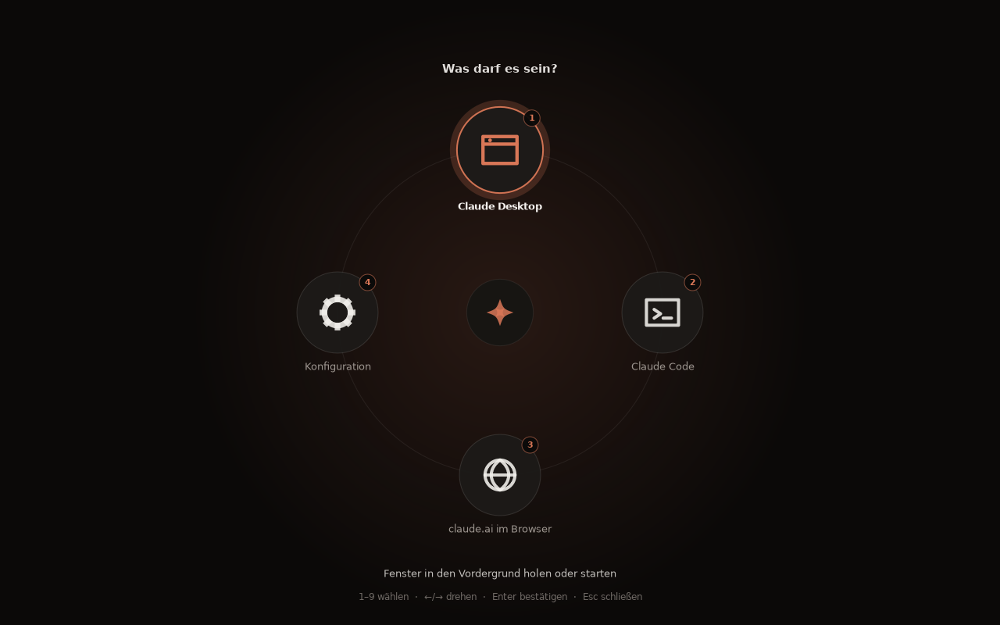

# copilot-key

**English** · [Deutsch](README.de.md)

Make the Copilot key on the **Minisforum AI X1 Pro** actually useful — on
Linux, with a radial menu, a window toggle and a sound set of its own.

* **Press once** → bring the primary action's window to the front, or minimise
  it if it is already focused. If nothing is running, the menu opens instead.
* **Press twice quickly** → always open the menu.
* **Press again while the menu is open** → close it.
* Every state change has its own audio cue.

The menu is a fullscreen overlay: it dims the desktop and unrolls in a circle
from the centre. Drive it with `1`–`9`, the arrow keys, the scroll wheel or the
mouse; `Esc` or a click outside dismisses it. The icons are plain Cairo vector
drawings — no icon theme, no third-party artwork.



Built for Linux Mint 22.3 (Cinnamon, X11, Ubuntu 24.04 base). The menu is
verified against GTK 3; the key chain should be confirmed once on the target
machine with `detect-key.sh`.

---

## Installation

```bash
git clone https://github.com/SoulInfernoDE/copilot-key-linux
cd copilot-key-linux
./install.sh
```

Run it as your normal user — the script calls `sudo` itself where root is
actually needed. It will:

1. Check dependencies (`wmctrl`, `xdotool`, `python3-gi`, `python3-gi-cairo`,
   `pulseaudio-utils`)
2. Install `keyd` — from the package sources, otherwise built from source into
   `~/Downloads/keyd` with prefix `/usr/local`
3. Install the launcher to `~/.local/bin`, the sounds to
   `~/.local/share/copilot-key` and the config to
   `~/.config/copilot-key/config.toml`
4. Copy `config/keyd-copilot.conf` to `/etc/keyd/copilot.conf` and restart `keyd`
5. Register the Cinnamon shortcut `Ctrl+Alt+Shift+F12` → `copilot-key`

To remove it: `./uninstall.sh`

After pulling an update, simply run `./install.sh` again — your existing
configuration is left untouched.

---

## How the key gets through

The Copilot key does not send a key code of its own. It sends the chord
**LeftMeta + LeftShift + F23**, which most desktop environments refuse to
accept as a shortcut — hence the two-stage chain:

```
Copilot key  →  keyd (evdev, ahead of X11/Wayland)  →  Ctrl+Alt+Shift+F12  →  desktop shortcut  →  copilot-key
```

`keyd` works below the window system, so the same setup applies to X11 and
Wayland alike.

If your key sends something else,

```bash
./detect-key.sh
```

shows what it really emits (via `keyd monitor`, falling back to `evtest`, then
`xev`). The common alternatives are already present as commented-out lines in
`config/keyd-copilot.conf` — swap the line, then `sudo keyd reload`.

---

## Configuration

`~/.config/copilot-key/config.toml`. Changes take effect on the next key press;
nothing needs restarting.

```toml
[general]
sounds = true
volume = 0.7
double_press_ms = 450
single_press = "toggle_or_menu"   # or "toggle" / "menu"
menu_title = "Was darf es sein?"
close_on_focus_loss = true
menu_style = "radial"             # or "list" for a plain vertical list
dim_opacity = 0.62                # how far the desktop behind is dimmed

[[actions]]
id = "claude-desktop"
label = "Claude Desktop"
subtitle = "Bring the window to the front, or start it"
command = "@claude-desktop"
icon = "window"
window_class = "claude"
primary = true
```

The order of the `[[actions]]` is the order in the menu and maps to the number
keys `1`–`9`. Set `close_on_focus_loss = false` if the menu disappears too
early on an unusual desktop.

| Placeholder in `command` | Effect |
|---|---|
| `@claude-desktop` | looks for an installed Claude desktop app, falls back to `claude.ai` in the browser |
| `@terminal <cmd>` | runs `<cmd>` in a new terminal window (the terminal stays open afterwards) |
| `@browser <url>` | opens `<url>` in the default application |
| `@edit-config` | opens this file in the default editor |

Anything else is executed as an ordinary command line. `window_class` is a
substring of the window's `WM_CLASS`; find yours with `wmctrl -lx`.

Available `icon` values: `window`, `terminal`, `globe`, `gear`, `chat`,
`folder`, `power`, `sparkle`. Without one, the icon is guessed from `id` and
`label`, defaulting to `sparkle`.

**A note on "Claude Desktop":** there is no official desktop app for Linux. The
common unofficial packages are detected (`claude-desktop`, `claude-desktop-app`,
`claude-desktop-bin`); if none is installed, the action opens `claude.ai` in the
browser instead. The `@terminal claude` action, on the other hand, starts the
official **Claude Code CLI**.

---

## Troubleshooting

```bash
./doctor.sh
```

checks the installation, the sound files, the audio server, the available
players, the graphics libraries, keyd and the desktop shortcut — and plays a
test cue at the end. No sound? The usual suspects:

* `pulseaudio-utils` missing → `sudo apt install pulseaudio-utils`
* Sounds not installed → run `./install.sh` again
* One player refusing the file (`pw-play` rejects Ogg Vorbis in some builds):
  `COPILOT_KEY_DEBUG=1 ~/.local/bin/copilot-sound menu-open 0.9` shows which
  player took it and which turned it down

If you get a plain list instead of the radial menu, `python3-gi-cairo` is
missing (`sudo apt install python3-gi-cairo`).

---

## Sounds

Six cues from one sound family — soft glass bells on a pentatonic scale over D,
short, quiet (peak −18 dBFS) and with a gentle attack, so nothing clicks or
demands attention:

| Cue | When | Character |
|---|---|---|
| `menu-open` | the menu opens | two rising notes, questioning |
| `menu-dismiss` | dismissed with Esc | the same falling and damped |
| `launch` | an action starts | rising arpeggio, affirmative |
| `toggle-show` | window comes forward | bright blip with an upward glide |
| `toggle-hide` | window is minimised | the same blip downwards |
| `error` | action not available | low two-tone, deliberately not harsh |

Listen to them:

```bash
~/.local/bin/copilot-key test-sounds
```

The files are **synthesised from scratch** — pure additive synthesis with numpy,
no samples, no recordings, no third-party audio of any kind. The generator is
included and reproduces them exactly:

```bash
python3 tools/generate_sounds.py sounds
```

To use your own: drop `.ogg` or `.wav` files with the same names into
`~/.local/share/copilot-key/sounds`.

---

## Other desktops

The installer registers the shortcut automatically on Cinnamon only. Elsewhere,
bind `Ctrl+Alt+Shift+F12` to `~/.local/bin/copilot-key` by hand:

* **GNOME** — Settings → Keyboard → Keyboard Shortcuts → Custom Shortcuts
* **KDE Plasma** — System Settings → Shortcuts → Custom Shortcuts
* **XFCE** — Settings → Keyboard → Application Shortcuts

Under Wayland the menu and the sounds work; toggling windows needs
`wmctrl`/`xdotool` and therefore X11 or XWayland. Dimming the background
requires a running compositor (the default under Cinnamon); without one the
overlay simply covers the screen opaquely.

---

## Project layout

```
bin/copilot-key          launcher: toggle logic, menu, cue playback
bin/copilot-sound        cue playback (paplay / pw-play / ffplay / mpv / aplay)
config/config.toml       template for the user configuration
config/keyd-copilot.conf keyd rule for the Copilot chord
sounds/                  six CC0 cues
tools/generate_sounds.py sound generator
detect-key.sh            shows what the key actually sends
doctor.sh                checks installation, audio chain and shortcut
docs/menu.png            screenshot of the radial menu
install.sh / uninstall.sh
```

---

## License

Code: **MIT** (see `LICENSE`).
Sounds: **CC0 1.0** (see `sounds/LICENSE`).

This project is not affiliated with Anthropic, Microsoft or Minisforum.
"Claude", "Copilot" and "Minisforum" are trademarks of their respective owners
and are used here descriptively only.
